# Introdução

* **Projeto:** ***FinUp (Financial Upgrade)***
* **Repositório GitHub:** [Grupo 6 - Falta de Gestão Financeira](https://github.com/ICEI-PUC-Minas-PPLCC-TI/ti-1-ppl-cc-m-2024-2-g6-falta-de-gestao-financeira)
* **Membros da equipe:**
  * [Adriano Araújo Domingos dos Santos](https://github.com/adrianoaraujods)
  * [Filipe Nery Rabelo](https://github.com/Filnr)
  * [Gabriel Corrêa Costa](https://github.com/Gabriel00110)
  * [Nikolas Petrick Castro Mendes](https://github.com/nickmiyah)
  * [Rondinelly Martins Silva ](https://github.com/Rondi17)
  * [Victor Rabelo Souza](https://github.com/VictorRS7)

A documentação do projeto é estruturada da seguinte forma:

- [Introdução](#introdução)
- [Contexto](#contexto)
  - [Problema](#problema)
  - [Objetivos](#objetivos)
  - [Justificativa](#justificativa)
  - [Público-Alvo](#público-alvo)
- [Product Discovery](#product-discovery)
  - [Etapa de Entendimento](#etapa-de-entendimento)
      - [Matriz CSD:](#matriz-csd)
      - [Mapa de Stakeholders:](#mapa-de-stakeholders)
      - [Entrevistas qualitativas](#entrevistas-qualitativas)
      - [Highlight de pesquisa](#highlight-de-pesquisa)
  - [Etapa de Definição](#etapa-de-definição)
    - [Personas](#personas)
      - [João Silva Pereira](#joão-silva-pereira)
      - [Marcos Costa](#marcos-costa)
      - [Anna Ribeiro](#anna-ribeiro)
- [Product Design](#product-design)
  - [Histórias de Usuários](#histórias-de-usuários)
  - [Proposta de Valor](#proposta-de-valor)
      - [Proposta de valor para Persona 1](#proposta-de-valor-para-persona-1)
      - [Proposta de valor para Persona 2](#proposta-de-valor-para-persona-2)
      - [Proposta de valor para Persona 3](#proposta-de-valor-para-persona-3)
  - [Requisitos](#requisitos)
    - [Requisitos Funcionais](#requisitos-funcionais)
    - [Requisitos não Funcionais](#requisitos-não-funcionais)
  - [Projeto de Interface](#projeto-de-interface)
    - [Wireframes](#wireframes)
      - [Login](#login)
      - [Criar Conta](#criar-conta)
      - [Registros](#registros)
      - [Adicionar Registro](#adicionar-registro)
      - [Criar Categoria](#criar-categoria)
      - [NavBar Menu](#navbar-menu)
      - [Evolução](#evolução)
      - [Metas](#metas)
      - [Criar Meta](#criar-meta)
      - [Editar Meta](#editar-meta)
    - [User Flow](#user-flow)
    - [Protótipo Interativo](#protótipo-interativo)
- [Metodologia](#metodologia)
  - [Ferramentas](#ferramentas)
  - [Gerenciamento do Projeto](#gerenciamento-do-projeto)
- [Referências](#referências)

[Documentação de Design Thinking (MIRO)](files/PPLCC-M%20-%20G6%20-%20Falta%20de%20gestão%20financeira.pdf)

# Contexto

A falta de gestão financeira pessoal é um problema crescente, especialmente com o aumento da acessibilidade ao crédito e ao consumo digital. Muitas pessoas enfrentam dificuldades para gerenciar suas finanças de forma adequada, o que resulta em gastos impulsivos, falta de planejamento e endividamento. Essa situação torna difícil para grande parte da população manter uma visão clara e realista de seus ganhos e despesas.

## Problema

A falta de gestão financeira pessoal é um problema crescente, que afeta grande parte da população. Muitas pessoas têm dificuldade em controlar suas finanças, o que resulta em um desequilíbrio financeiro. Isso pode levar ao acúmulo de dívidas, compras impulsivas e gastos desnecessários, prejudicando o planejamento a longo prazo. A ausência de ferramentas acessíveis e de uma educação financeira eficiente contribui para que esses problemas se perpetuem, afetando diretamente a qualidade de vida e a estabilidade financeira das pessoas.

## Objetivos

Nosso objetivo é desenvolver um software educativo, com ferramentas que ensine o usuário a estebelecer uma educação financeira eficiente, identificando os principais pontos onde deve mudar, bem como estebelecer metas de economia e limite de gastos.

## Justificativa

Nós identificamos que grande parte das pessoas possuem dificuldade na gestão do próprio dinheiro. O uso do cartão de crédito aliado à práticas ruins, como inscrição em serviços de assinatura mensal(spotify, netflix, amazon, youtube premium, etc...) e também compras impulsivas de itens superfluos na internet, dentre outras, são fatores que dificultam a organização do dinheiro gasto. Isso tem como consequência o endividamento de muitas pessoas, que acabam vivendo no limite da sua renda.

## Público-Alvo

As pessoas que relatam ter maior dificuldade para gerir seu dinheiro, são os das [gerações Y e Z](https://pontaltech.com.br/blog/marketing/geracoes-x-y-z-alpha-beta/), visto que os mais velhos ainda utilizam bastante dinheiro físico, e tem maior rigor com seus gastos. Jovens e adultos entre 20 e 45 anos são os principais afetados por esse problema.

# Product Discovery

## Etapa de Entendimento

#### Matriz CSD:
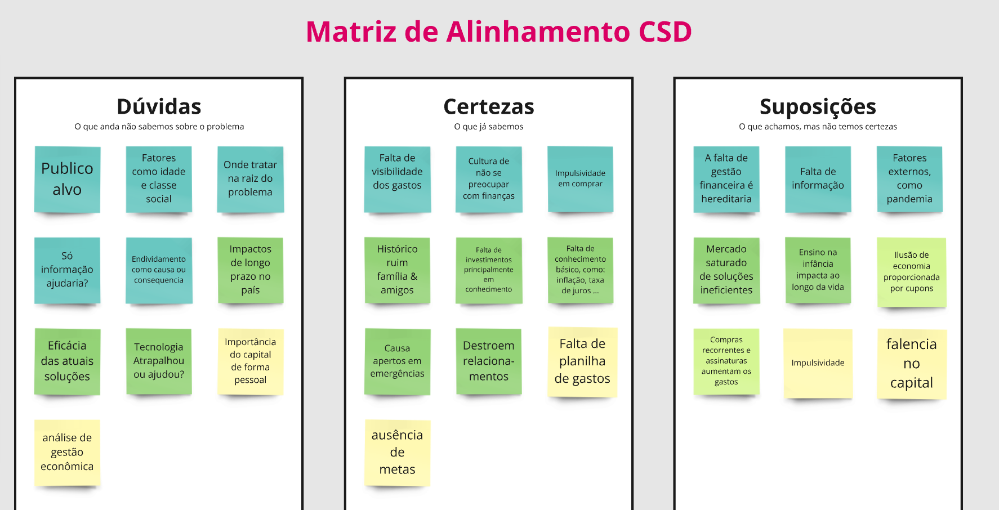
#### Mapa de Stakeholders:
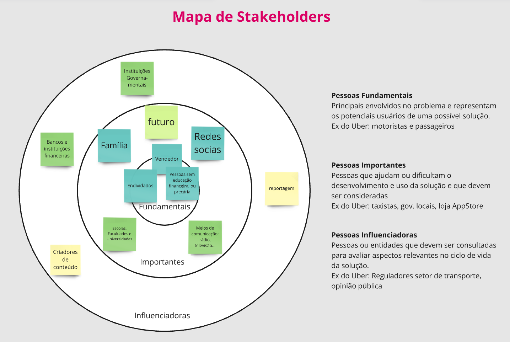
#### Entrevistas qualitativas
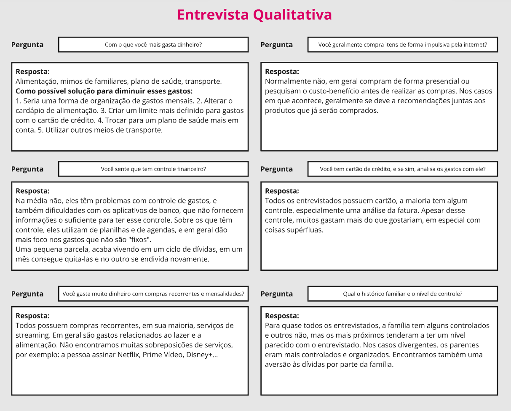
#### Highlight de pesquisa

## Etapa de Definição

### Personas

#### João Silva Pereira
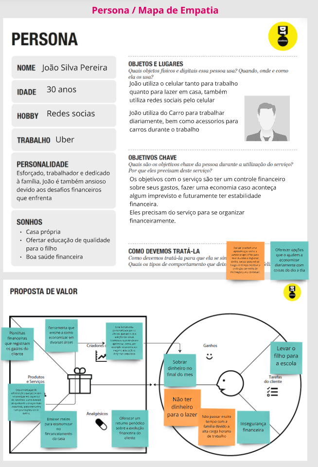
 

#### Marcos Costa
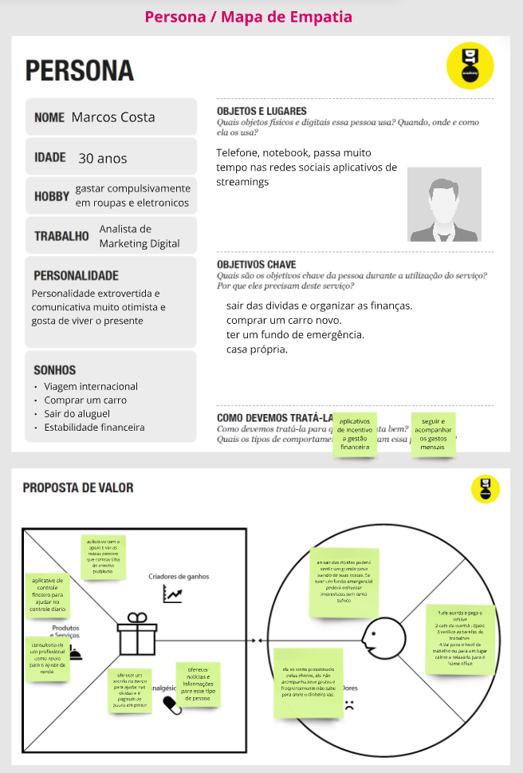
 

#### Anna Ribeiro
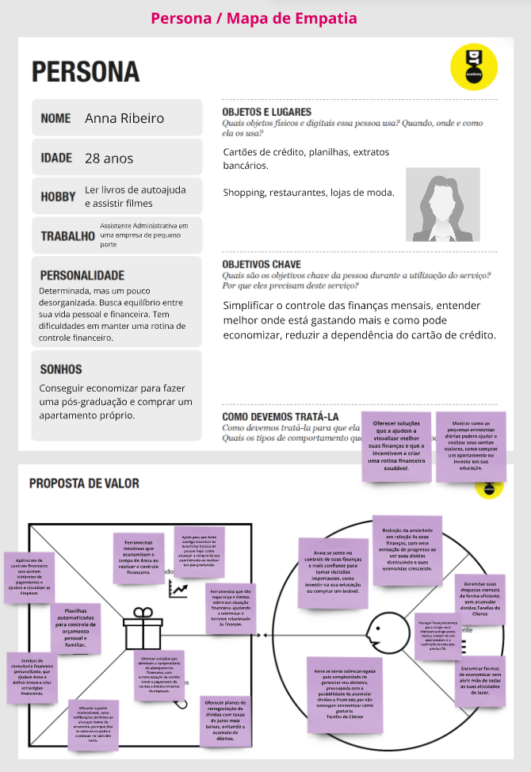

# Product Design

Nesse momento, vamos transformar os insights e validações obtidos em soluções tangíveis e utilizáveis. Essa fase envolve a definição de uma proposta de valor, detalhando a prioridade de cada ideia e a consequente criação de wireframes, mockups e protótipos de alta fidelidade, que detalham a interface e a experiência do usuário.

## Histórias de Usuários

Com base na análise das personas foram identificadas as seguintes histórias de usuários:

| EU COMO... | QUERO/PRECISO ...        | PARA ...               |
| --------------------- | ------------------------------------------ | -------------------------------------- |
| Endividado  | - Mais dinheiro   - Uma forma de organizar minhas finanças| - Quitar minhas dívidas   - Ter mais dinheiro   - Não me endividar             |
| Consumista         | - Cancelar assinaturas de pouco uso   - Diminuir compras banais   - Criar limite de gastos no cartão     | - Diminuir gastos   - Ter autocontrole   - Diminuir a culpa de compras supérfluas |
| Trabalhador  | - Mais dinheiro   - Diminuir gastos   - Não gastar além do meu salário | - Não endividar   - Construir uma reserva de emergência   - Ter uma boa saúde financeira |
| Funcionário | - Aumento salarial   - Renda extra   - Reserva de emergência | - Ter estabilidade financeira   - Ajudar em casa |
| Pai | - Estabelecer limites de compras para meus filhos   - Definir metas de investimentos e/ou economia   - Acompanhar melhor os gastos familiares | - Sobrar dinheiro para uma viagem   - Ficar mais tranquilo quanto às despezas |
| Estudante | - Economizar | - O dinheiro não ser um obstáculo aos meus estudos  |

## Proposta de Valor

#### Proposta de valor para Persona 1

 

#### Proposta de valor para Persona 2
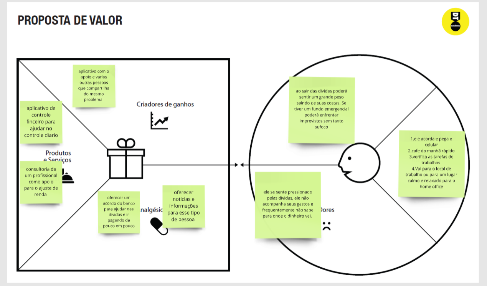
 

#### Proposta de valor para Persona 3
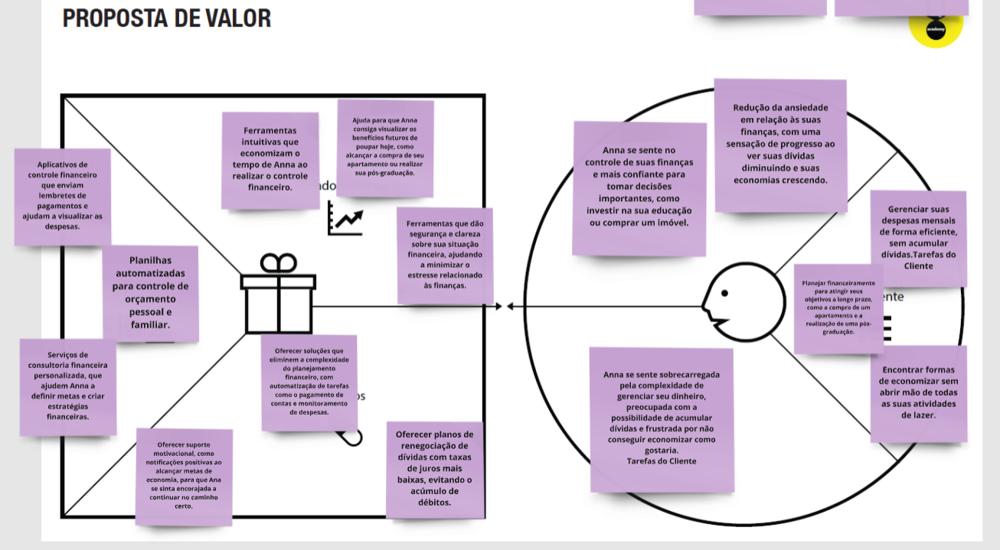
 

## Requisitos

As tabelas que se seguem apresentam os requisitos funcionais e não funcionais que detalham o escopo do projeto.

### Requisitos Funcionais

| ID     | Descrição do Requisito                                   | Prioridade |
| ------ | ---------------------------------------------------------- | ---------- |
| RF-001 | Anotar receitas e despesas, com possibilidade de categorização. | ALTA       |
| RF-002 | Visualizar todas as entradas e saídas registradas. | MÉDIA     |
| RF-003 | Definir metas e objetivos de economias, podendo estipular a quantidade e a duração. | ALTA |
| RF-004 | Definir um limite de gasto, e verificar se está dentro dele. | ALTA |
| RF-005 | Projeções de valores economizados, um gráfico mostrando o valor que será economizado em relação ao tempo. | ALTA |
| RF-006 | Comparação entre intervalos de tempo, meses, semanas e anos. | MÉDIA |
| RF-007 | Área de ensino, disponibilizando conteúdo sobre economia e saúde financeira. | MÉDIA |
| RF-008 | Definição de receitas e despesas recorrentes de forma automática. | ALTA |
| RF-009 | Importar dados de planilhas (arquivos .csv) | MÉDIA |
| RF-010 | Exportar dados para arquivo .csv | MÉDIA |

### Requisitos não Funcionais

| ID    | Descrição do Requisito                                                              | Prioridade |
| ------- | ------------------------------------------------------------------------------------- | ---------- |
| RNF-001 | Sistema de conta, com acesso através de credenciais. | ALTA |
| RNF-002 | Disponibilidade 24 horas, todos os dias da semana. | ALTA |
| RNF-003 | Acesso gratuito, salvo recursos que indicam o contrário. | ALTA |
| RNF-004 | Aplicação Web, possibilitando o uso em qualquer dispositivo e em qualquer hora e local com acesso à internet. | MÉDIA |

## Projeto de Interface

Artefatos relacionados com a interface e a interacão do usuário na proposta de solução.

### Wireframes

Estes são os protótipos de telas do sistema.

#### Login
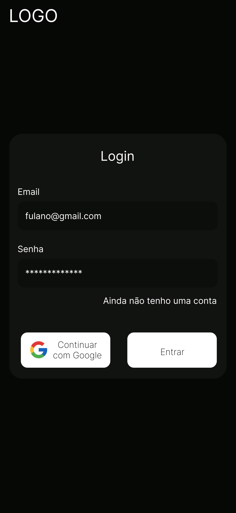

#### Criar Conta
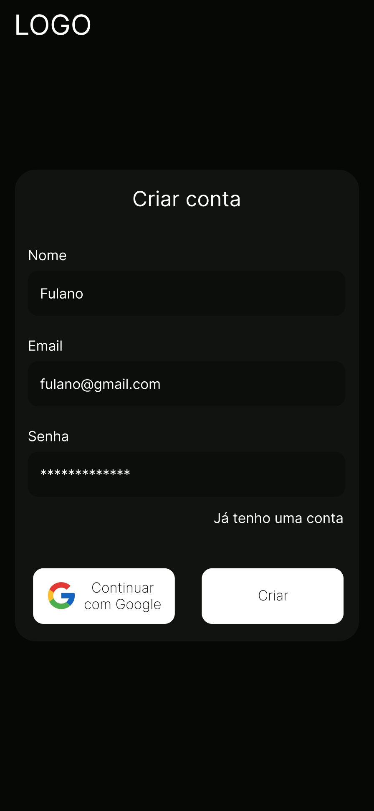

#### Registros
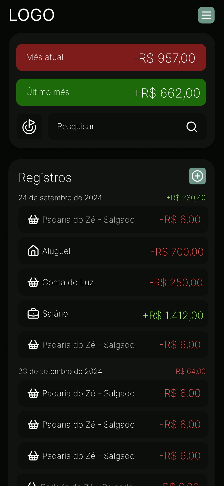

#### Adicionar Registro
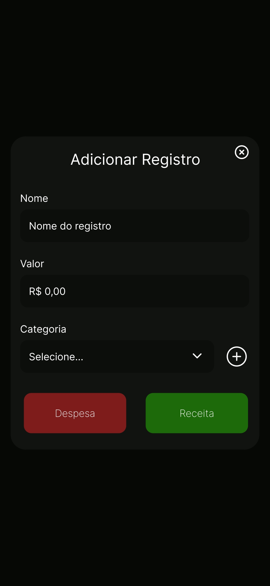

#### Criar Categoria
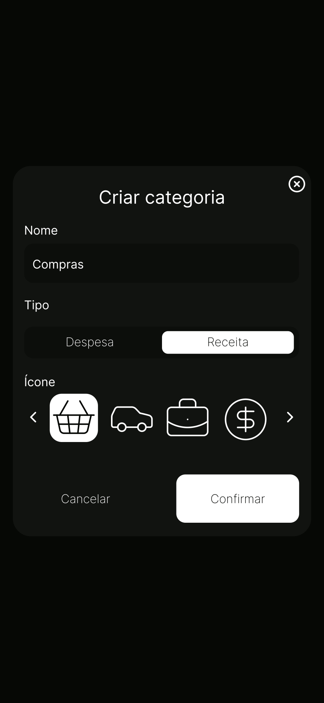

#### NavBar Menu

#### Evolução
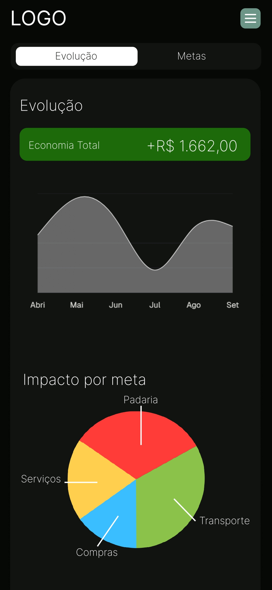

#### Metas
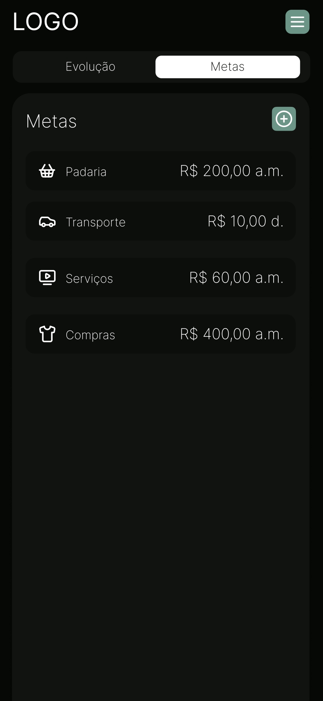

#### Criar Meta
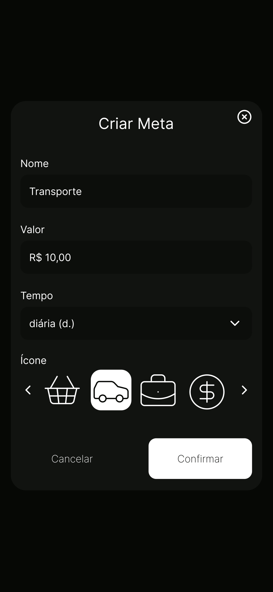

#### Editar Meta
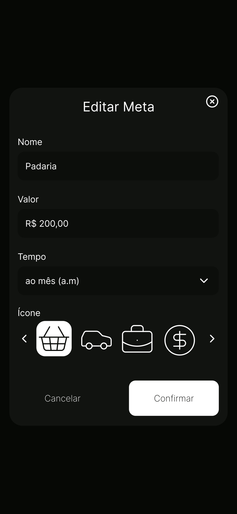

### User Flow

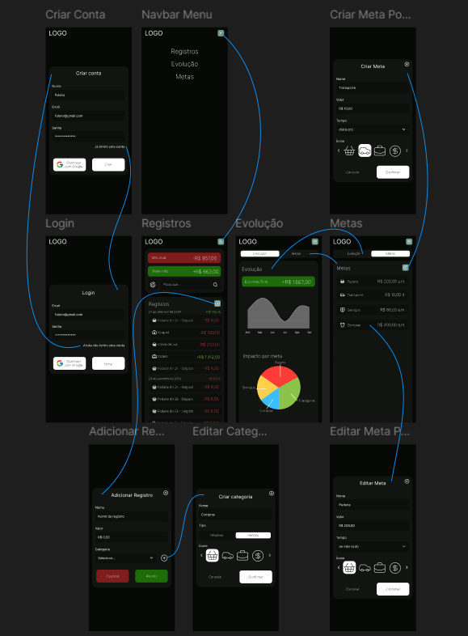

### Protótipo Interativo

https://marvelapp.com/prototype/10ie6d3b/screen/95600300

# Metodologia

Durante o desenvolvimento do projeto, utilizamos diversas ferramentas para otimizar o processo e garantir a eficiência das entregas. O Miro foi utilizado como plataforma principal para o processo de Design Thinking, permitindo a criação de fluxos de ideias e o desenvolvimento colaborativo de soluções. Para o versionamento e armazenamento do código, adotamos o GitHub, que proporcionou um ambiente centralizado e acessível para o gerenciamento do código-fonte e o acompanhamento das modificações feitas pela equipe. Na idealização e desenvolvimento da interface do usuário, empregamos o Figma, garantindo agilidade e facilidade durante o processo criativo. Por fim, o MarvelApp foi usado para a criação do protótipo interativo, permitindo que os usuários experimentassem a interface da aplicação antes de sua implementação completa.

## Ferramentas

Relação de ferramentas empregadas pelo grupo durante o projeto.

| Ambiente                    | Plataforma | Link de acesso                                     |
| --------------------------- | ---------- | -------------------------------------------------- |
| Processo de Design Thinking | Miro       | https://miro.com/app/board/uXjVKn-VohI=/           |
| Repositório de código     | GitHub     | https://github.com/ICEI-PUC-Minas-PPLCC-TI/ti-1-ppl-cc-m-2024-2-g6-falta-de-gestao-financeira    |
| Wireframes e Userflow         | Figma    | https://www.figma.com/design/iOqomTUN7adzGyKTcTEzQV/G6---Falta-de-Gest%C3%A3o-Financeira |
| Protótipo Interativo       | MarvelApp  | https://marvelapp.com/prototype/10ie6d3b/screen/95600300   |

## Gerenciamento do Projeto

Divisão de papéis no grupo e apresentação da estrutura da ferramenta de controle de tarefas (Kanban).

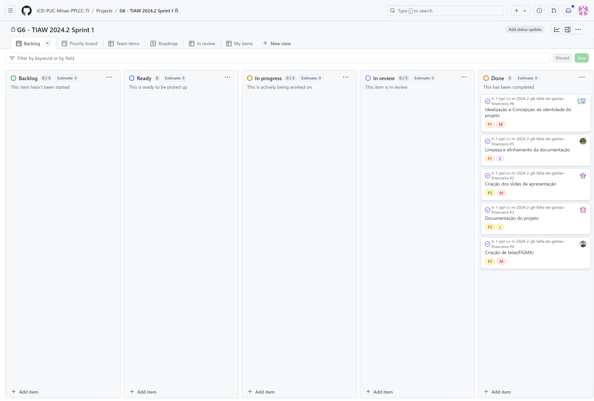

# Referências
DANTAS, A. Estudo sobre o perfil socioeconômico de motoristas de aplicativo no Brasil. Revista Brasileira de Economia, v. 75, n. 2, p. 123-137, 2021.

INSTITUTO BRASILEIRO DE GEOGRAFIA E ESTATÍSTICA (IBGE). Pesquisa de Orçamentos Familiares: Despesas familiares e endividamento. Brasília: IBGE, 2020. Disponível em: https://www.ibge.gov.br. Acesso em: 18 set. 2024.

SERVIÇO DE PROTEÇÃO AO CRÉDITO (SPC). Estudo sobre hábitos de consumo e controle financeiro. São Paulo: SPC, 2019.
